# Manual do Portal do Cliente — FC Engenharia

> Documento técnico completo para alimentar uma base NotebookLM (ou equivalente).
> Cobre cada tela, cada aba, cada KPI, cada regra de negócio do **Portal do Cliente**
> da plataforma ERP da FC Engenharia, ilustrado com **prints reais** capturados
> diretamente do ambiente de produção (obra REVTE-CIVIL — Santuário Nacional de
> Nossa Senhora da Conceição Aparecida).
>
> Versão da plataforma capturada: **Rev. 1601**
> Data da captura: **10/05/2026**
> Cliente de exemplo: **Felipe Alves** (Santuário Aparecida)
> Obras vinculadas: **REVTE-CIVIL** (em execução) e **VITRA**

---

## Sumário

1. [Visão geral e propósito do Portal](#1-visão-geral-e-propósito-do-portal)
2. [Arquitetura, segurança e tenant isolation](#2-arquitetura-segurança-e-tenant-isolation)
3. [Tela de Login](#3-tela-de-login)
4. [Recuperação de senha](#4-recuperação-de-senha)
5. [Hub do Cliente — tela inicial](#5-hub-do-cliente--tela-inicial)
6. [Seleção de Obra](#6-seleção-de-obra)
7. [Módulo Planejamento da Obra](#7-módulo-planejamento-da-obra)
   - 7.1 [Visão Geral](#71-visão-geral)
   - 7.2 [Cronograma](#72-cronograma)
   - 7.3 [Avanço Semanal](#73-avanço-semanal)
   - 7.4 [Programação Semanal](#74-programação-semanal)
   - 7.5 [Curva S](#75-curva-s)
   - 7.6 [Revisões](#76-revisões-do-cronograma)
   - 7.7 [Gantt](#77-gantt)
   - 7.8 [REFIS](#78-refis--relatório-de-fiscalização)
   - 7.9 [Caminho Crítico](#79-caminho-crítico)
   - 7.10 [Efetivo da Obra](#710-efetivo-da-obra)
   - 7.11 [Diagrama de Rede](#711-diagrama-de-rede)
8. [Módulo Projetos / Documentos Técnicos](#8-módulo-projetos--documentos-técnicos)
9. [Módulo Avaliação Anônima (NPS)](#9-módulo-avaliação-anônima-nps)
10. [Módulos em desenvolvimento](#10-módulos-em-desenvolvimento)
11. [Regra de ouro — Paridade Portal × Planejamento](#11-regra-de-ouro--paridade-portal--planejamento)
12. [Glossário técnico](#12-glossário-técnico)

---

## 1. Visão geral e propósito do Portal

O **Portal do Cliente** é uma área externa, separada do ERP interno, onde os
**clientes contratantes** da FC Engenharia acompanham, em tempo real e com total
transparência, o andamento das suas obras. Ele se posiciona como uma **vitrine
controlada** do ERP: tudo que o portal mostra é calculado pelo mesmo motor do
módulo interno de Planejamento — nunca há cálculo paralelo, nunca há divergência.

### Para quem é

- Diretores e representantes do contratante (ex.: Santuário Nacional Aparecida)
- Gerenciadoras / fiscalização técnica (ex.: Lotus Projetos & Soluções)
- Conselheiros e patrocinadores que precisam de leitura executiva sem acesso ao ERP

### O que o portal entrega

- **Cronograma físico** (avanço previsto vs realizado, SPI/CPI, REFIs)
- **Documentação técnica de projetos** (arquitetura, estrutural, hidráulica…)
- **Efetivo da obra** (próprios FC e terceiros alocados, com ASO/treinamentos)
- **Avaliação anônima** (pesquisa NPS configurável mês/ano)
- Em desenvolvimento: Galeria de fotos, Boletins de medição, Solicitações

### Não é

- Não é um portal de **terceirizados/parceiros** — esses entram pelo **Portal
  do Prestador de Serviço** (link separado: "Entrar pelo portal externo").
- Não é o ERP interno da FC — clientes não veem custos, contratos com
  fornecedores, folha de pagamento, etc.

---

## 2. Arquitetura, segurança e tenant isolation

| Item | Implementação |
|---|---|
| **Rota base** | `/portal/cliente/*` (separada do ERP em `/`) |
| **Autenticação** | JWT próprio do portal (token `pc_token` armazenado em `localStorage`) |
| **Identificação** | CNPJ do cliente, CPF do representante, ou e-mail cadastrado |
| **Backend** | tRPC router `server/routers/portalExterno.ts` — namespace `cliente.*` |
| **Tenant isolation** | Toda query carrega `companyId` + filtro de obras vinculadas |
| **401 handler** | `client/src/main.tsx` trata 401 sem redirecionar para o login do ERP |
| **Liberações** | Por cliente são definidos **módulos** (`mod_planejamento`, `mod_proj_doc`, `mod_avaliacao`…) e **abas** internas (cronograma, curva-s, refis, etc.) |

### Endpoints principais consumidos pelo Portal

```
portalExterno.cliente.meuPerfil
portalExterno.cliente.meusDados
portalExterno.cliente.minhasObras
portalExterno.cliente.liberacoes
portalExterno.cliente.planejamentoObra
portalExterno.cliente.efetivoObra
portalExterno.cliente.documentosRhObra
portalExterno.cliente.projDocObra
portalExterno.cliente.podeAvaliarEsteMes
portalExterno.cliente.criarAvaliacao
portalExterno.cliente.listarComentarios
```

### Fluxo lógico

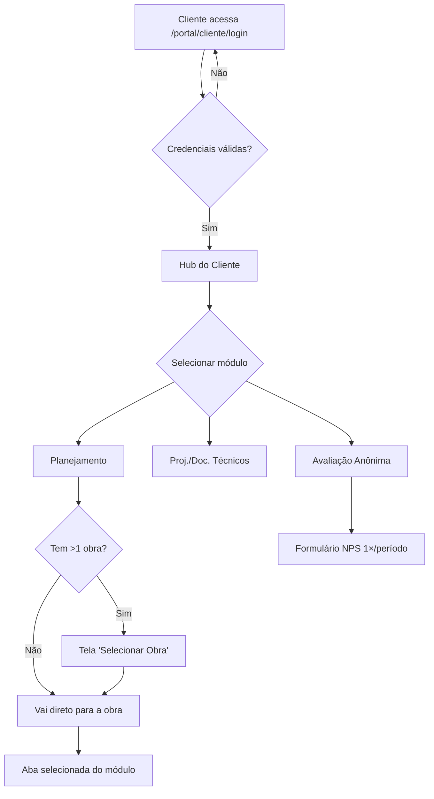
```mermaid
flowchart TD
    A[Cliente acessa /portal/cliente/login] --> B{Credenciais válidas?}
    B -- Não --> A
    B -- Sim --> C[Hub do Cliente]
    C --> D{Selecionar módulo}
    D --> E[Planejamento]
    D --> F[Proj./Doc. Técnicos]
    D --> G[Avaliação Anônima]
    E --> H{Tem >1 obra?}
    H -- Sim --> I[Tela 'Selecionar Obra']
    H -- Não --> J[Vai direto para a obra]
    I --> J
    J --> K[Aba selecionada do módulo]
    G --> L[Formulário NPS 1×/período]
```

---

## 3. Tela de Login

**Rota**: `/portal/cliente/login`
**Componente**: `client/src/pages/portal/PortalLoginCliente.tsx`

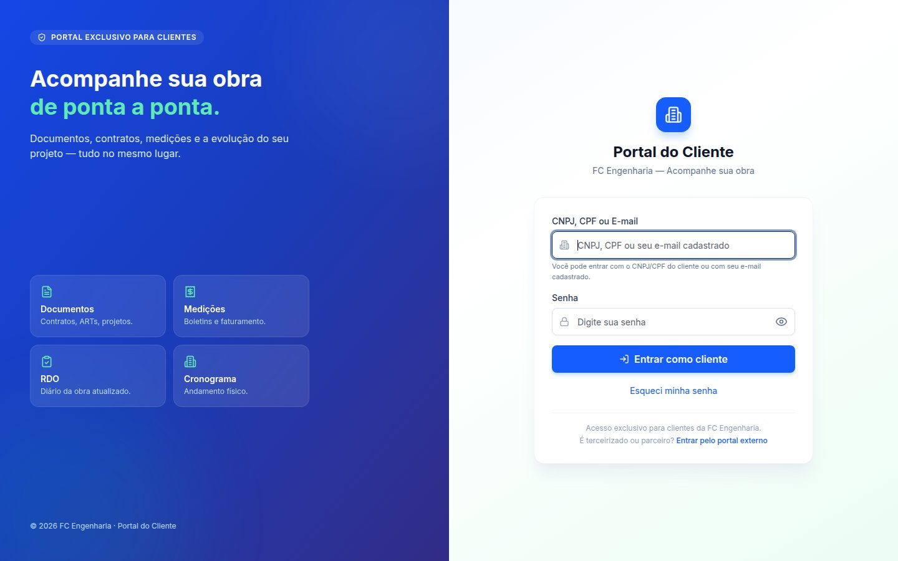

### Layout

A tela usa um layout de **duas colunas** em desktop:

- **Esquerda (azul gradiente)**: branding institucional ("Acompanhe sua obra de
  ponta a ponta") com 4 cards de pré-visualização do que o portal entrega:
  Documentos · Medições · RDO · Cronograma.
- **Direita (clara)**: o card de login propriamente dito.

### Campos

| Campo | Aceita | Validação |
|---|---|---|
| **CNPJ, CPF ou E-mail** | Os três formatos — o backend detecta automaticamente | Texto livre |
| **Senha** | Senha cadastrada (botão olho para mostrar/ocultar) | mínimo 1 caractere |

### Botões e links

- **Entrar como cliente** — botão primário azul. Faz `POST` em
  `portalExterno.loginCliente` (linha 49 do router) e devolve um JWT.
- **Esqueci minha senha** — vai para `/portal/cliente/esqueci-senha`.
- **Entrar pelo portal externo** — link no rodapé para terceiros/parceiros
  (portal diferente).

### Após preencher

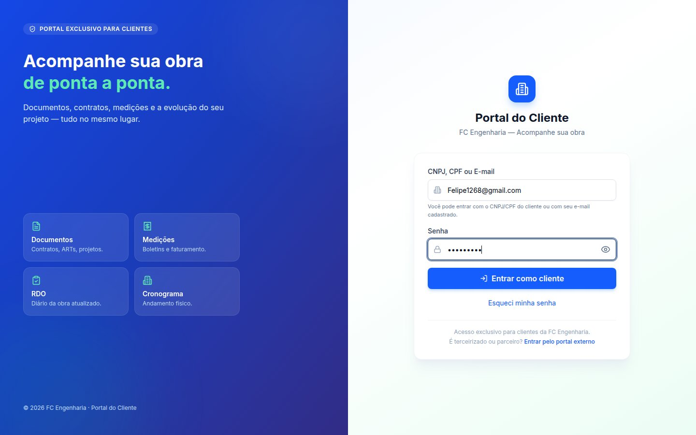

Quando o e-mail é digitado, o ícone de cadeado fica visível no input. Após
clicar em **Entrar**, o portal redireciona automaticamente para
`/portal/cliente/hub`.

### Regras de segurança

- O handler global de 401 do app **NÃO** redireciona rotas `/portal/*` para o
  login do ERP (corrigido na Rev. 1601 em `client/src/main.tsx`).
- Cookies/JWT do portal são totalmente separados dos do ERP — um usuário
  interno logado no ERP **não** entra automaticamente no portal.

---

## 4. Recuperação de senha

**Rota**: `/portal/cliente/esqueci-senha`

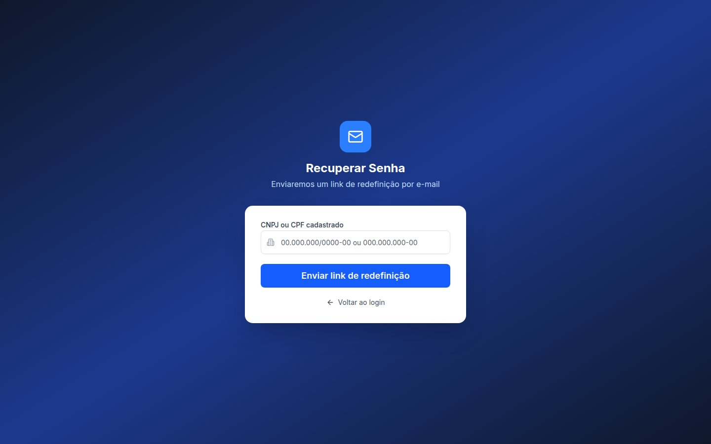

### O que faz

O cliente informa **CNPJ ou CPF cadastrado** e o sistema envia um link de
redefinição por e-mail (SMTP da FC). O fluxo:

1. Cliente preenche CNPJ/CPF (com máscara automática).
2. Clica em **Enviar link de redefinição**.
3. Backend procura o cadastro, gera um token de uso único, dispara um e-mail.
4. Cliente abre o link e define a nova senha em uma tela dedicada.

### Botões

- **Enviar link de redefinição** — primário, azul.
- **← Voltar ao login** — secundário, link.

### Mensagens

O endpoint sempre retorna a mesma resposta genérica
(`"Se o cadastro existir, você receberá o link"`) para evitar **enumeração de
contas**.

---

## 5. Hub do Cliente — tela inicial

**Rota**: `/portal/cliente/hub`
**Componente**: `client/src/pages/portal/PortalHubCliente.tsx`

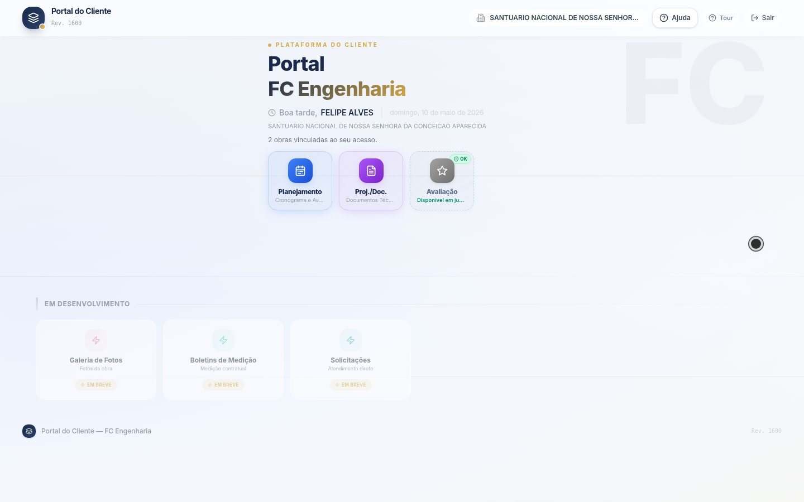

### Cabeçalho

- **Logo + "Portal do Cliente · Rev. 1688"** à esquerda.
- Nome da obra principal vinculada à direita (ex.: "SANTUÁRIO NACIONAL DE NOSSA
  SENHORA…"), com botões **Ajuda**, **Tour** e **Sair**.

### Boas-vindas

- Saudação dinâmica: "Boa tarde, **FELIPE ALVES**" + data por extenso em
  português.
- Linha indicando quantas obras o usuário tem acesso ("**2 obras vinculadas ao
  seu acesso**").

### Cards de módulos liberados

Cada card é um **tile** com ícone, nome e subtítulo. Os módulos visíveis dependem
das **liberações** cadastradas pelo Master para esse cliente.

| Card | Estado no exemplo | Comportamento |
|---|---|---|
| **Planejamento** (cronograma e avanço) | Liberado | Abre seleção de obra → Visão Geral |
| **Proj./Doc.** (documentos técnicos) | Liberado | Abre seleção de obra → Lista de docs |
| **Avaliação** (pesquisa anônima) | **Desativado** com badge ✓ "OK" + texto "Disponível em junho/2026" | Já avaliou esse período — abre toast informando próxima janela |

### Seção "EM DESENVOLVIMENTO"

Tiles cinza, **clique não navega** — apenas comunicam roadmap:

- **Galeria de Fotos** — fotos da obra (em breve)
- **Boletins de Medição** — medição contratual (em breve)
- **Solicitações** — atendimento direto (em breve)

### Regras

- A **ordem dos cards** é fixa.
- Se o cliente tem **apenas 1 obra**, o clique vai direto para o módulo da
  obra. Se tem **2+**, abre primeiro a tela de seleção (item 6).
- O card **Avaliação** muda visualmente conforme o helper compartilhado
  `shared/portalAvaliacao.ts` (badge OK + traçado pontilhado quando já
  avaliado no período).

---

## 6. Seleção de Obra

Quando o cliente tem mais de uma obra vinculada e clica em **Planejamento** ou
**Proj./Doc.**, o sistema apresenta uma tela intermediária de escolha.

### 6.1 Seleção para o Planejamento

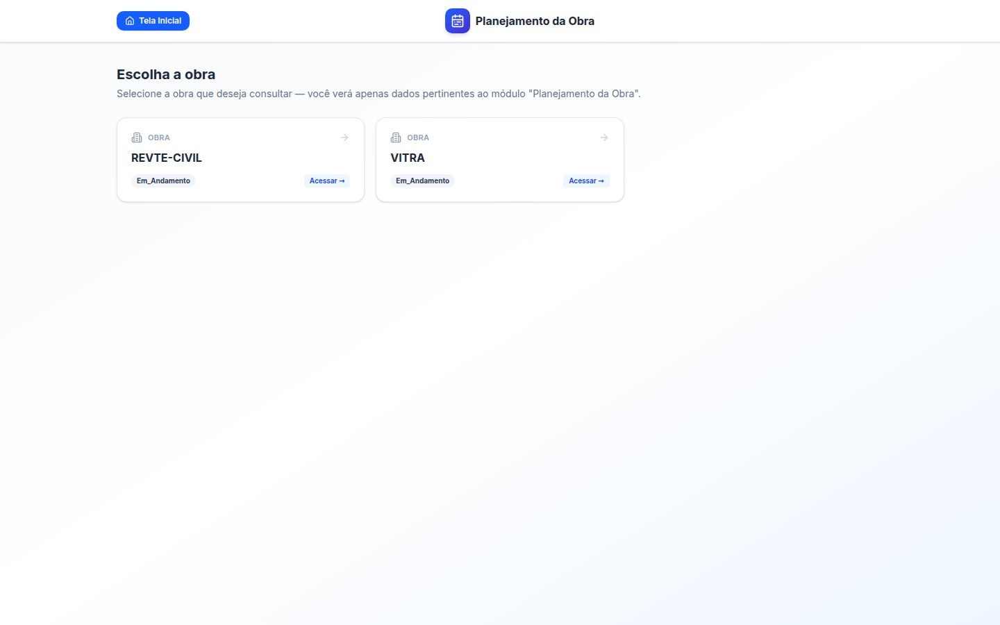

- Título: "Planejamento da Obra".
- Subtítulo: "Escolha a obra · Selecione a obra que deseja consultar — você verá apenas dados pertinentes ao módulo Planejamento da Obra."
- Cards de obra com **código** (REVTE-CIVIL, VITRA), badge de status
  (`Em_Andamento`) e link **Acessar →**.
- Botão **Tela Inicial** no canto superior esquerdo para voltar ao Hub.

### 6.2 Seleção para Proj./Doc.

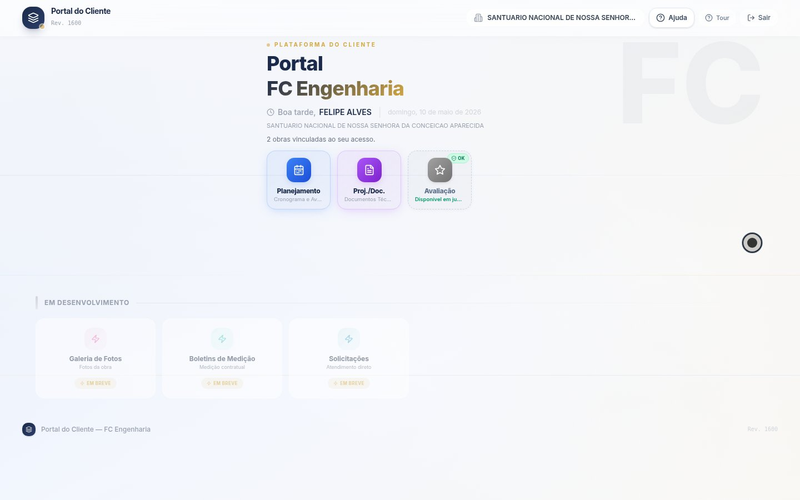

Idêntica em estrutura, mas o título e o ícone do topo mudam para **Projetos /
Documentos Técnicos**.

### Regras

- **Filtro automático**: o portal só lista obras em que o cliente tem
  vínculo ativo (`portal_clientes_obras`).
- Obras `deletedAt IS NOT NULL` nunca aparecem.
- O status mostrado vem da coluna `status` da obra (`Em_Andamento`,
  `Concluida`, `Pausada`, etc.).

---

## 7. Módulo Planejamento da Obra

**Rota**: `/portal/cliente/planejamento/:obraId`
**Componente**: `client/src/pages/portal/PortalPlanejamentoCliente.tsx`
**Endpoint**: `portalExterno.cliente.planejamentoObra`

### Layout comum a todas as abas

- **Sidebar à esquerda** com:
  - Logo "FC Engenharia · Portal do Cliente"
  - Botão **Tela Inicial do Portal**
  - Seletor de obra (combobox "OBRA · clique para trocar")
  - Campo de **Buscar no menu**
  - Lista de **abas do projeto** (Visão Geral, Cronograma, Avanço Semanal,
    Prog. Semanal, Curva S, Revisões, Gantt, REFIS, Caminho Crítico, Efetivo,
    Diagrama de Rede)
  - **Tela Inicial do Portal** + **Trocar de Obra** no rodapé
- **Cabeçalho da obra** (sempre visível em cima):
  - Banner com **Logo da Executora (FC)** | **Logo do Cliente** | **Logo da
    Gerenciadora** (Lotus, no exemplo).
  - Card branco com: badge `PLANEJAMENTO · Rev. 00`, código da obra
    (REVTE-CIVIL), CNPJ/cliente, gestor responsável (Caio Augusto da Silva
    Garufe), tempo restante (**409d restantes**), botões **Imprimir / PDF /
    Tela Inicial do Portal**, badge de status (`EM_ANDAMENTO`).
  - Bloco **Avanço Físico**:
    - Barra **Previsto** dourada (1,84%) com ponta amarela.
    - Barra **Realizado** azul (1,38%) com ponta azul.
    - Badges à direita: "**−0,46% atrasado**" (vermelho) e
      "**Peso Financeiro**" (cinza, indica que a curva é ponderada por
      pesos financeiros, não por quantidade pura).
    - Linha de rodapé: "Cálculo ao vivo · último REFIS oficial: Nº 001 ·
      semana 04/05/2026".

### Regra de ouro

> O Portal **NUNCA** pode divergir do módulo interno Planejamento. Mesmo
> universo de atividades (folhas com `dataInicio && dataFim`), mesmo
> denominador, mesma convenção para indiretas (curva prevista linear no
> realizado). Veja [seção 11](#11-regra-de-ouro--paridade-portal--planejamento).

---

### 7.1 Visão Geral

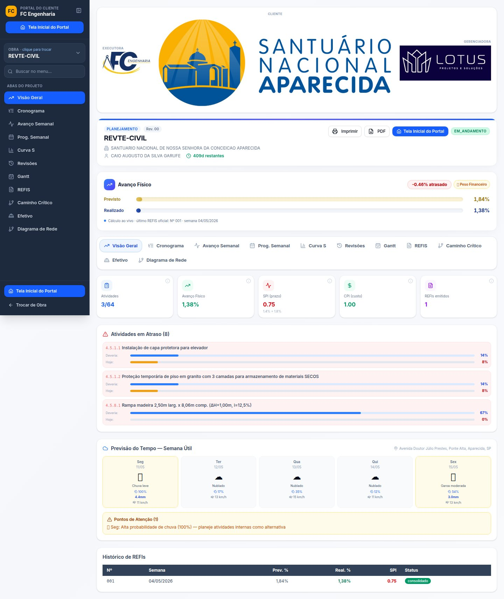

#### KPIs (5 cards)

| Card | Valor (REVTE-CIVIL) | Significado |
|---|---|---|
| **Atividades** | 3/64 | Atividades concluídas / total de folhas EAP que entram no cálculo |
| **Avanço Físico** | 1,38% | Realizado acumulado, ponderado por peso financeiro |
| **SPI (prazo)** | 0,75 (1,4% → 1,4%) | Schedule Performance Index — Realizado / Previsto |
| **CPI (custo)** | 1,00 | Cost Performance Index (medições) |
| **REFIs emitidos** | 1 | Quantidade de relatórios oficiais consolidados |

#### Bloco "Atividades em Atraso (8)"

Lista das atividades em execução que estão abaixo do previsto até a data atual.
Para cada uma exibe:

- Código EAP + nome
- Linha **Deveria** (cinza/dourado) com % previsto até hoje
- Linha **Hoje** (laranja) com % realizado

Exemplo do print:

- `4.5.1.1 Instalação de capa protetora para elevador` — Deveria 14% / Hoje 8%
- `4.5.1.2 Proteção temporária de piso em granito com 3 camadas…` — 14% / 8%
- `4.5.8.1 Rampa madeira 2,50m larg. x 8,06m comp. (ΔH=1,00m, l=12,5%)` — 67% / 0%

#### Bloco "Previsão do Tempo — Semana Útil"

Integração com **OpenWeather** localizada por endereço da obra (Av. Doutor Júlio
Prestes, Ponte Alta, Aparecida-SP). Cards de **segunda a sexta**, cada um com
ícone, descrição (Chuva leve, Nublado, Garoa moderada…), probabilidade de chuva,
volume em mm e velocidade do vento em km/h.

Abaixo, **Pontos de Atenção** — sumarização automática:

> "Seg: Alta probabilidade de chuva (100%) — planeje atividades internas como
> alternativa."

#### Bloco "Histórico de REFIS"

Tabela com Nº, semana (dd/MM/aaaa), Prev %, Real %, SPI e Status
(`consolidado`).

---

### 7.2 Cronograma

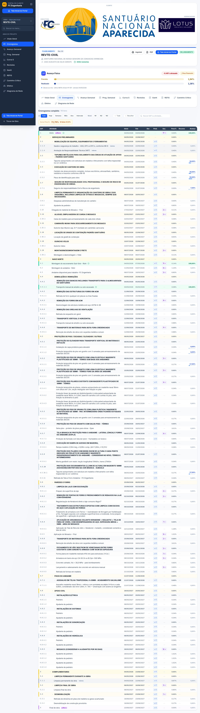

Lista hierárquica de **todas as 116 atividades** da EAP, com colunas:

- **EAP** (1, 2, 2.2, 2.2.1, 4.4.1.1, …)
- **Atividade** (descrição)
- **Início / Fim** (dd/MM/aaaa)
- **Duração** (dias)
- **Predecessora**
- **Status** / **% Realizado** com barra colorida

Grupos pais aparecem em **negrito** com indentação. A tela suporta scroll
vertical longo (no print há grupos como "Mobilização de Canteiro", "Demolições e
Remoções", "Sinalização", "Tapumes", "Banheiros Químicos", "Andaimes",
"Instalações Elétricas", "Hidráulicas", etc.).

---

### 7.3 Avanço Semanal

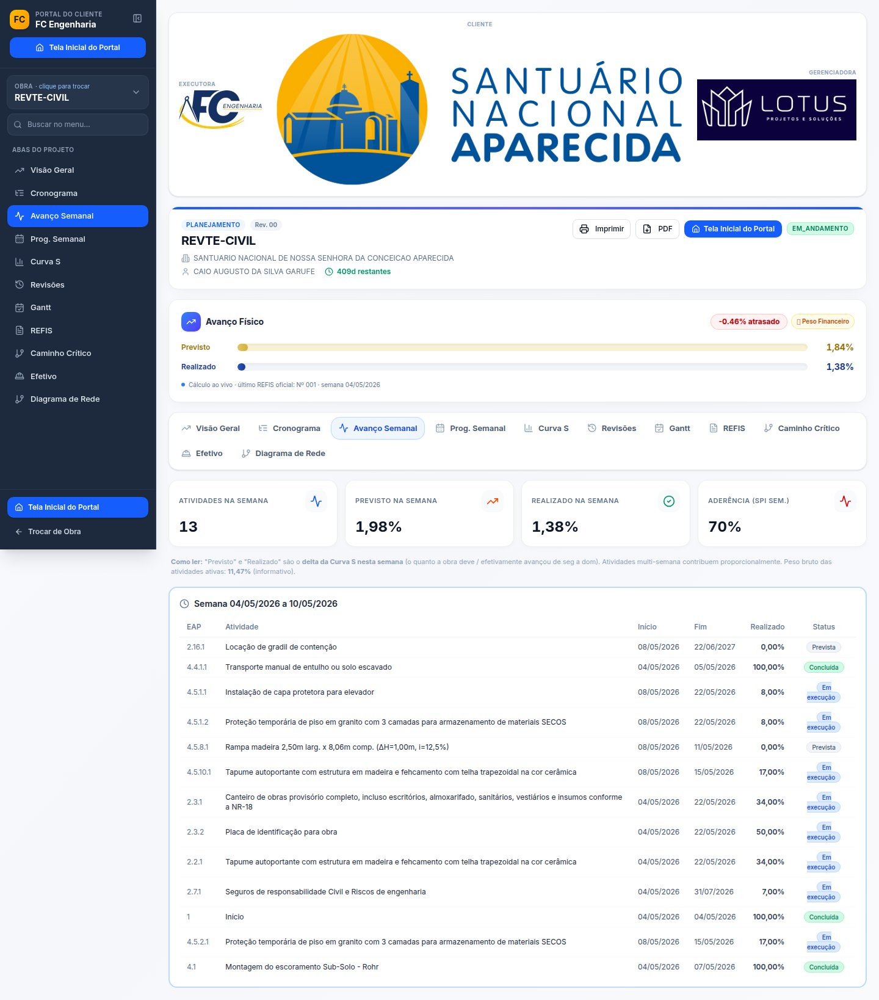

#### KPIs da semana atual (4 cards)

| Card | Valor | Significado |
|---|---|---|
| **Atividades na Semana** | 13 | Quantas atividades estão ativas na janela seg→dom |
| **Previsto na Semana** | 1,98% | Δ que a obra deveria avançar entre seg e dom |
| **Realizado na Semana** | 1,38% | Δ efetivo lançado |
| **Aderência (SPI sem.)** | 70% | Realizado / Previsto da semana |

> Nota explicativa exibida em tela: "'Previsto' e 'Realizado' são o **delta** da
> Curva S nesta semana (o quanto a obra deve / efetivamente avançou de seg a
> dom). Atividades multi-semana contribuem proporcionalmente. Peso bruto das
> atividades ativas: 11,47% (informativo)."

#### Lista de atividades da semana

Período `04/05/2026 a 10/05/2026`. Para cada linha:

- EAP, Atividade, Início, Fim, % Realizado, Status
  (`Concluída` / `Em execução` / `Prevista`).

---

### 7.4 Programação Semanal

> Aba listada na sidebar como **"Prog. Semanal"**. Não foi capturada porque o
> seletor automatizado procurou pelo texto "Programação". O conteúdo é
> análogo ao Avanço Semanal mas focado em **planejado para a próxima semana**
> (não no realizado da semana atual). Dados vêm de `progSemanal[]` do
> endpoint `planejamentoObra`.

---

### 7.5 Curva S

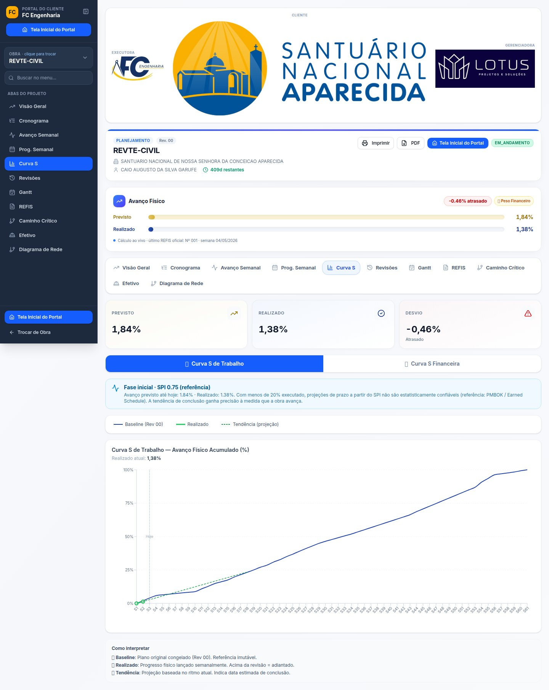

#### Cards de cabeçalho

| Card | Valor |
|---|---|
| Previsto | **1,84%** |
| Realizado | **1,38%** |
| Desvio | **−0,46% Atrasado** |

#### Toggle de visualização

- **Curva S de Trabalho** (avanço físico em %) — selecionada no print
- **Curva S Financeira** (medições em R$ acumulado)

#### Banner "Fase inicial · SPI 0,75 (referência)"

> "Avanço previsto até hoje: 1,84% · Realizado: 1,38%. Com menos de 20%
> executado, projeções de prazo a partir do SPI **não são estatisticamente
> confiáveis** (referência: PMBOK / Earned Schedule). A tendência de conclusão
> ganha precisão à medida que a obra avança."

Esse banner foi adicionado para **não emitir alarmismos** quando o avanço está
abaixo de ~20% (SPI puro extrapola conclusões absurdas — ex.: "138 dias de
atraso projetado"). Acima de 20% a projeção clássica volta a valer.

#### Gráfico

- **Baseline (Rev 00)** — linha tracejada cinza
- **Realizado** — linha verde sobreposta no início
- **Tendência (projeção)** — linha pontilhada azul subindo até 100%
- Eixo X: semanas; Eixo Y: % acumulado

#### Como interpretar (texto sob o gráfico)

- **Baseline**: plano original congelado (Rev 00). Referência imutável.
- **Realizado**: progresso físico lançado semanalmente. Acima da revisão = adiantado.
- **Tendência**: projeção baseada no ritmo atual. Indica data estimada de conclusão.

---

### 7.6 Revisões do Cronograma

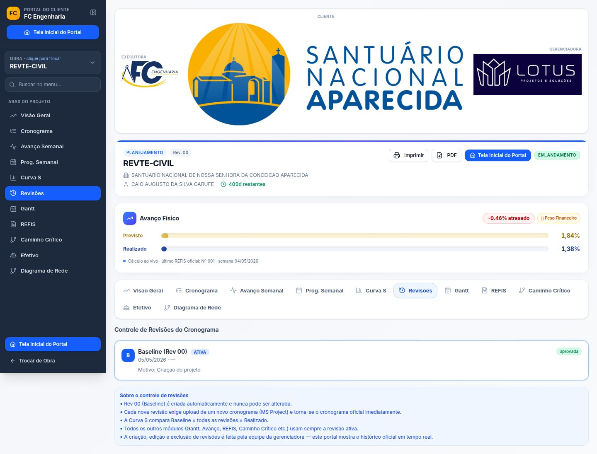

Lista vertical das revisões do cronograma. No exemplo: apenas a **Baseline (Rev 00) ATIVA**, criada em 05/05/2026 com motivo "Criação do projeto", status `aprovada`.

#### Caixa "Sobre o controle de revisões"

- Rev 00 (Baseline) é criada automaticamente e **nunca pode ser alterada**.
- Cada nova revisão exige upload de um novo cronograma (MS Project) e torna-se o
  cronograma oficial imediatamente.
- A Curva S compara **Baseline × todas as revisões × Realizado**.
- Todos os outros módulos (Gantt, Avanço, REFIS, Caminho Crítico, etc.) usam
  **sempre a revisão ativa**.
- A criação, edição e exclusão de revisões é feita pela equipe da
  gerenciadora — este portal mostra o histórico oficial em tempo real.

---

### 7.7 Gantt

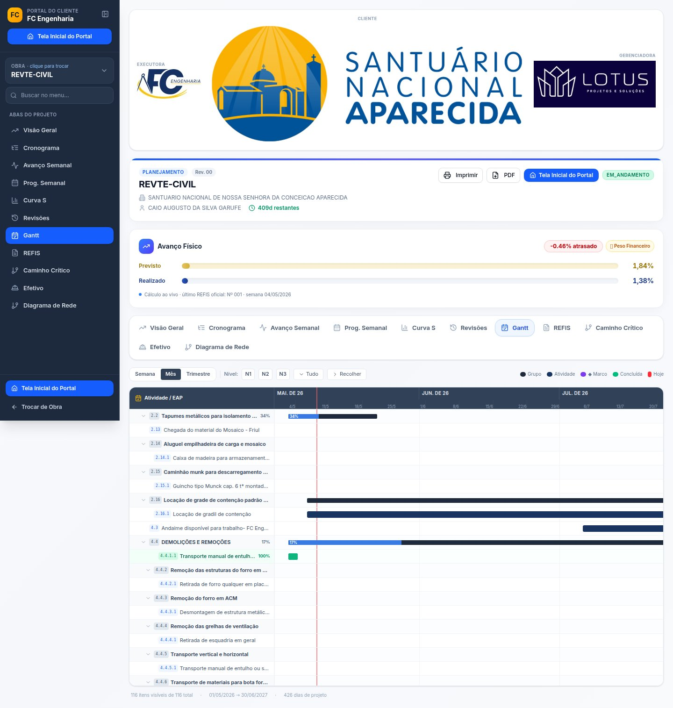

Diagrama de Gantt interativo. Controles no topo:

- Granularidade temporal: **Semana / Mês / Trimestre**
- Filtro de níveis EAP: **N1 / N2 / N3 / Tudo / Recolher**
- Legenda: **Grupo** (preto), **Atividade** (azul), **Marco** (losango roxo),
  **Concluída** (verde), **Hoje** (linha vermelha vertical)

Para cada linha:

- Colunas EAP + Atividade (com indentação por nível)
- Barra horizontal posicionada nas datas Início → Fim, com fundo cinza e
  preenchimento azul mostrando o **% realizado** (ex.: "34%" rotulado dentro da
  barra).

Rodapé: "**116 itens visíveis de 116 total · 01/05/2026 → 30/06/2027 · 426 dias
de projeto**".

---

### 7.8 REFIS — Relatório de Fiscalização

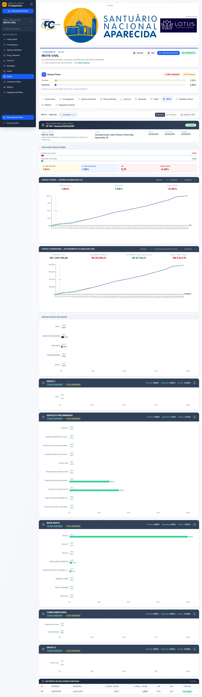

Cada REFIS é um **snapshot semanal oficial** do andamento da obra, emitido pela
gerenciadora. Mostra-se o REFIS mais recente expandido.

#### Cabeçalho do REFIS

- Nº 001 — Semana 04/05/2026
- Avanço Previsto até a data: **1,84%**
- Avanço Realizado até a data: **1,38%**
- SPI: **0,75**
- Desvio: **−0,46%**

#### Gráficos do REFIS

1. **Curva S Física — Avanço Acumulado (%)** — previsto × realizado.
2. **Curva S Financeira — Faturamento Acumulado (R$)** — Previsto R$ 29.055,21,
   Realizado R$ 19.728,51, Desvio R$ −9.321,70.

#### Avanços físicos por grupo

Lista por grupo da EAP (Serviços Preliminares, Nave Norte, Complementares, Grupo
B, etc.) com barra de previsto vs realizado e desvio %.

#### Histórico de REFIS

Tabela com colunas Nº, Semana, Prev %, Real %, SPI, Status.

---

### 7.9 Caminho Crítico

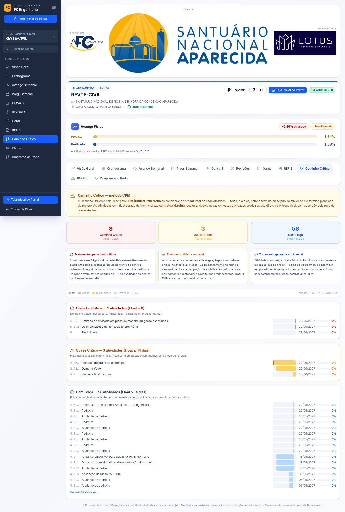

#### Explicação no topo

> "Caminho Crítico — método CPM. O Caminho Crítico é calculado pelo CPM
> (Critical Path Method) considerando o **float total** de cada atividade —
> folga, em dias, entre o término planejado da atividade e o término planejado
> do projeto. As atividades com float zerado definem o **prazo contratual da
> obra**: qualquer desvio negativo nessas atividades produz atraso direto na
> entrega final, sem absorção pela rede de precedências."

#### Três blocos coloridos (KPIs)

| Bloco | Valor | Float |
|---|---|---|
| **Caminho Crítico** (vermelho) | 3 atividades | Float = 0 dias |
| **Quase Crítico** (amarelo) | 3 atividades | Float ≤ 14 dias |
| **Com Folga** (azul) | 58 atividades | Float > 14 dias |

#### Tratamento operacional / tático / gerencial

Três cards explicando como o gestor deve tratar cada categoria (diário /
semanal / quinzenal).

#### Listas detalhadas

- **Caminho Crítico — 3 atividades (Float = 0)**: 5.3.1 Retirada de divisória,
  5.3.2 Desmobilização da construção provisória, 6 Final de obra.
- **Quase Crítico — 3 atividades**: 2.16.1 Locação de gradil, 1.15… Guincho
  Velox, 5.2.1 Limpeza final da obra.
- **Com Folga — 58 atividades** (lista parcial visível com botão "Ver mais").

Rodapé: "Float calculado como diferença entre a data fim da atividade e a data
fim do projeto. Sem dados de predecessoras está a uma aproximação heurística
(mesma fórmula usada no módulo interno do Planejamento)."

---

### 7.10 Efetivo da Obra

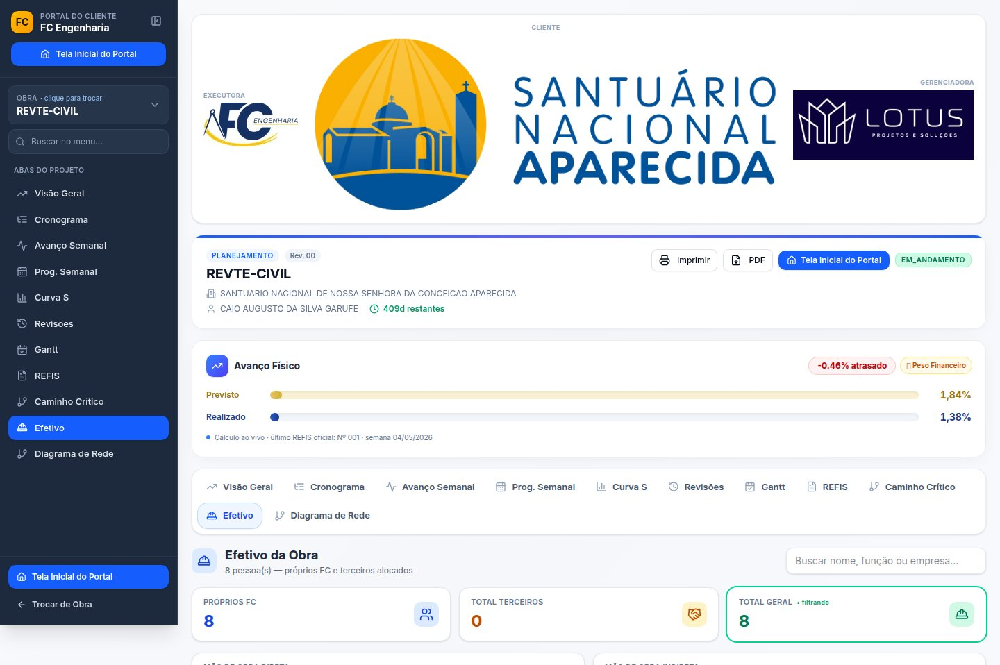

#### Cards-totalizadores (também são filtros clicáveis)

| Card | Valor |
|---|---|
| **Próprios FC** | 8 |
| **Total Terceiros** | 0 |
| **Total Geral · filtrando** | 8 |

Clicando em um card, a tabela abaixo filtra automaticamente.

#### Tabela de pessoas

Cada linha de funcionário CLT/PJ é **clicável** (chevron + cursor pointer) e
expande inline um painel com:

- **ASO** (tipo, resultado, exame, validade) com botão **Ver PDF** inline
  (visualizador modal sem download).
- **Treinamentos** (norma + descrição da NR + validade — vencidos destacados em
  vermelho) com botão **Ver** por certificado.

Para terceiros, as colunas de RH mostram "—" (não estão no endpoint
`documentosRhObra`).

A tabela também tem campo de busca **"Buscar nome, função ou empresa…"** no
topo.

---

### 7.11 Diagrama de Rede

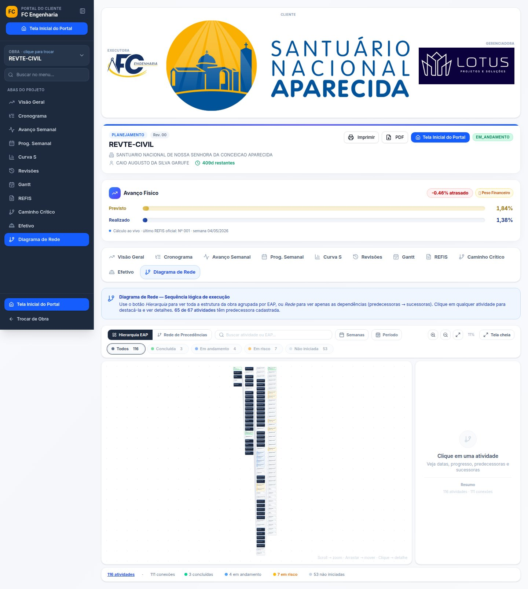

#### Explicação no topo

> "Diagrama de Rede — Sequência lógica de execução. Use o botão **Hierarquia**
> para ver toda a estrutura da obra agrupada por EAP, ou **Rede** para ver
> apenas as dependências (predecessoras → sucessoras). Clique em qualquer
> atividade para destacá-la e ver detalhes. **65 de 67 atividades têm
> predecessora cadastrada.**"

#### Toggles e filtros

- **Hierarquia EAP** vs **Rede de Precedências**
- Busca de atividade
- Períodos: Semanas / Período
- Zoom in/out, fullscreen, **Tela cheia**

#### Filtros de status

- **Todos** 116
- **Concluída** 3
- **Em andamento** 4
- **Em risco** 7
- **Não iniciada** 53

#### Painel à direita

Quando nenhuma atividade está selecionada, o painel mostra "Clique em uma
atividade · Veja datas, progresso, predecessoras e sucessoras". Resumo: **116
atividades · 111 conexões**.

---

## 8. Módulo Projetos / Documentos Técnicos

**Rota**: `/portal/cliente/projdoc/:obraId`
**Endpoint**: `portalExterno.cliente.projDocObra`

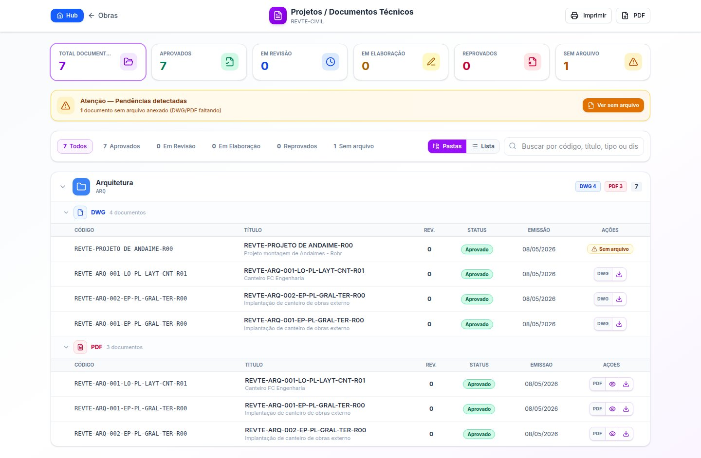

### Cabeçalho

- Botão **Hub** (volta ao Hub) e **← Obras** (volta à seleção de obra).
- Título **Projetos / Documentos Técnicos** com nome da obra (REVTE-CIVIL).
- Botões **Imprimir / PDF**.

### KPIs (6 cards)

| Card | Valor (REVTE-CIVIL) |
|---|---|
| Total documentos | 7 |
| Aprovados | 7 |
| Em revisão | 0 |
| Em elaboração | 0 |
| Reprovados | 0 |
| **Sem arquivo** | **1** |

### Banner de pendências

> "**Atenção — Pendências detectadas** · 1 documento sem arquivo anexado
> (DWG/PDF faltando)"
>
> Botão **Ver sem arquivo** filtra a lista para mostrar só os pendentes.

### Filtros / abas

- **Todos** (7), **Aprovados** (7), **Em Revisão** (0), **Em Elaboração** (0),
  **Reprovados** (0), **Sem arquivo** (1)
- Toggle **Pastas** / **Lista**
- Busca por código, título, tipo ou disciplina

### Lista (modo Pastas)

Documentos agrupados por **disciplina** (Arquitetura, Estrutural, Elétrica,
Hidráulica…). Cada disciplina tem dois subgrupos: **DWG** e **PDF**.

#### Colunas da tabela

- **Código** (ex.: `REVTE-ARQ-001-LO-PL-LAYT-CNT-R01`)
- **Título** (mesma coisa + subtítulo curto: "Canteiro FC Engenharia",
  "Implantação de canteiro de obras externo")
- **Rev.** (revisão atual: 0, 1, 2…)
- **Status** (`Aprovado` / `Em Revisão` / etc.)
- **Emissão** (data dd/MM/aaaa)
- **Ações**:
  - `DWG` + botão de download (para arquivos DWG)
  - `PDF` + botão **olho** (visualizador inline) + botão de download
  - `Sem arquivo` (badge laranja) quando não há binário anexado

### Visualizador de PDF inline

- Abre em iframe modal sem permitir download direto.
- Suporta gesto de **pinça (zoom)** no iOS Safari (corrigido na Rev. 1576):
  iframe marcado com classe `pdf-viewer-frame` + `touch-action: pinch-zoom pan-x
  pan-y` + `allow="fullscreen"`.

---

## 9. Módulo Avaliação Anônima (NPS)

**Componente**: integrado ao `PortalDashboardCliente` e ao Hub
**Endpoint**: `portalExterno.cliente.criarAvaliacao` + `podeAvaliarEsteMes`

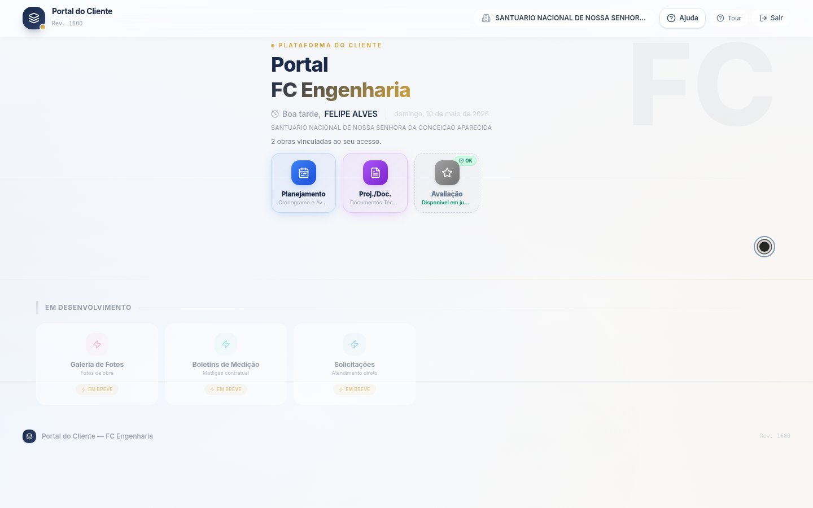

> No print, o card "Avaliação" no Hub aparece **desativado** porque o cliente
> Felipe Alves **já avaliou esse mês**. O badge ✓ "OK" e o subtítulo
> "Disponível em ju…" (junho/2026) refletem a regra de **1 avaliação por
> período** descrita abaixo.

### Periodicidade configurável

Por empresa, o admin define se a pesquisa é **mensal** (padrão) ou **anual**.
Isso afeta:

1. O limite anônimo (1 envio por janela).
2. As mensagens do portal do cliente.
3. O agrupamento no painel admin.

### Estado "já avaliei" — como aparece no portal

Helper compartilhado: `shared/portalAvaliacao.ts`. Atua em **3 pontos**:

| Local | Comportamento |
|---|---|
| **Hub do Cliente** | Card "Avaliação" cinza, traçado pontilhado, badge ✓ OK, subtítulo "Disponível em junho/2026" ou "Disponível em 2027" — clique exibe toast |
| **Dashboard** | Aba "Avaliação Anônima" desaparece da barra de tabs (URL `?tab=avaliacao` ainda mostra status "já registrada") |
| **Menu Planejamento → Outros módulos** | Item "Avaliação" desabilitado, check verde + "Disponível em <próximo período>" |

### As 8 perguntas CORE

Definidas em `shared/portalPerguntasCore.ts` — fonte única dos rótulos.

| Chave | Seção | Rótulo padrão |
|---|---|---|
| `notaGeral` | Geral | Nota geral (0 = péssimo · 10 = excelente) ★ |
| `notaEquipe` | Equipe FC | Equipe FC (técnica e relacionamento) |
| `notaGestor` | Gestor | Gestor responsável (liderança, decisões, proatividade) |
| `notaEmpresa` | Empresa | Empresa FC (reputação, transparência, comunicação institucional) |
| `notaObra` | Obra / Execução | Andamento da obra |
| `notaPrazo` | Obra / Execução | Cumprimento de prazos |
| `notaQualidade` | Obra / Execução | Qualidade do serviço entregue |
| `notaEscritorio` | Escritório Central | Atendimento administrativo (suporte, retorno de e-mails, agilidade) |

> O label **pode ser personalizado por empresa** via
> `cliente_perguntas_core_overrides`, mas a chave/seção/tipo são fixos para
> preservar o cálculo do NPS.

### Blocos de comentário aberto

- **Pontos Fortes** (ícone Smile)
- **Pontos Fracos** (ícone Frown)
- **Comentário do Escritório** (cor roxa no painel admin)

### Bloco "Empresa" e "Gestor"

Inclui também:

- Nota de **Empresa FC** (reputação, transparência…)
- Nota e **nome opcional** do Gestor responsável + texto livre
- Pergunta "Recomendaria a FC?" (Sim · Talvez · Não) — alimenta cálculo NPS

### Anonimato e auditoria

- A tabela `cliente_avaliacao_marcacoes` registra **apenas** o fato de que o
  usuário X enviou avaliação no período Y — **nunca** o conteúdo.
- O conteúdo vai para `cliente_avaliacoes` **sem o ID do usuário**.
- O Admin Master pode **cancelar** uma avaliação (preserva o registro com
  motivo + nome do master, exclui dos cálculos, libera o usuário a re-enviar).

### Cálculos no painel admin (referência)

- **Médias por critério**: 8 médias CORE + Escritório/Faturamento = 10 cards.
- **NPS**: calculado sobre `notaGeral` (0–6 detratores, 7–8 neutros, 9–10
  promotores).
- **Comentários**: listados na ordem cronológica reversa, agrupados por bloco.

---

## 10. Módulos em desenvolvimento

Visíveis no Hub mas não navegáveis (clicar não faz nada):

| Tile | Status | O que entregará |
|---|---|---|
| **Galeria de Fotos** | Em breve | Fotos da obra organizadas por data/fase |
| **Boletins de Medição** | Em breve | Medição contratual mensal (espelho do módulo interno **Medição**) |
| **Solicitações** | Em breve | Atendimento direto (chamados/solicitações abertos pelo cliente) |

---

## 11. Regra de ouro — Paridade Portal × Planejamento

> **O Portal do Cliente NUNCA pode divergir do módulo Planejamento.**
>
> O módulo **Planejamento é a fonte única da verdade** (REFIS, Curva S, Avanço
> Físico, SPI, etc.). Sempre que houver cálculo replicado no Portal
> (`PortalPlanejamentoCliente.tsx`), ele deve espelhar **EXATAMENTE** a
> fórmula do ERP em `PlanejamentoDetalhe.tsx` — mesmo universo de atividades
> (folhas com `dataInicio && dataFim`), mesmo denominador, mesma convenção
> para indiretas (curva prevista linear no realizado). Antes de fechar
> qualquer ajuste em métrica de planejamento, verificar lado-a-lado os dois
> lados.

### Convenções específicas

- **Folhas EAP**: somente atividades com `dataInicio` e `dataFim` definidas
  entram no cálculo. Grupos pais e marcos sem datas próprias são ignorados.
- **Pesos**: usa-se sempre **peso financeiro normalizado** (soma = 100%) — não
  contagem de atividades.
- **Indiretas**: a curva prevista de atividades indiretas é **linear** entre
  início e fim. O realizado segue a mesma regra (não exige medição manual).
- **Limiar de 20% para SPI**: o banner "Fase inicial" aparece quando o
  previsto até hoje < 20% — referência PMBOK / Earned Schedule (Walt Lipke,
  2003).

### Padrão de datas (Regra de ouro nº 2)

Toda data exibida ao usuário (tabelas, drill-downs, modais, listas, exports
visuais) deve estar em **dd/MM/aaaa**. Nunca exibir `YYYY-MM-DD` cru vindo do
banco. Padrão simples: `s.split("-").reverse().join("/")`.

---

## 12. Glossário técnico

| Sigla | Significado |
|---|---|
| **CPM** | Critical Path Method — método para calcular caminho crítico |
| **CPI** | Cost Performance Index — Custo Realizado / Custo Previsto (1,0 = no orçamento) |
| **EAP** | Estrutura Analítica do Projeto (WBS) |
| **ETA** | Estimated Time of Arrival — data projetada de conclusão |
| **Float** | Folga, em dias, entre término planejado e prazo da obra |
| **Gantt** | Diagrama de barras temporais de atividades |
| **Marco** | Atividade de duração zero (entrega, evento) |
| **NPS** | Net Promoter Score — métrica de satisfação |
| **PMBOK** | Project Management Body of Knowledge — guia PMI |
| **Predecessora** | Atividade que precisa terminar antes de outra começar |
| **REFIS** | Relatório de Fiscalização — snapshot semanal oficial |
| **SPI** | Schedule Performance Index — Realizado / Previsto (1,0 = no prazo) |
| **Tenant isolation** | Garantia de que dados de um cliente não vazam para outro |
| **WBS** | Work Breakdown Structure (= EAP) |

---

### Anexos / arquivos relacionados

- Componentes:
  - `client/src/pages/portal/PortalLoginCliente.tsx`
  - `client/src/pages/portal/PortalHubCliente.tsx`
  - `client/src/pages/portal/PortalPlanejamentoCliente.tsx`
  - `client/src/pages/portal/PortalProjDocCliente.tsx`
  - `client/src/pages/portal/PortalDashboardCliente.tsx`
- Backend:
  - `server/routers/portalExterno.ts` (router `cliente.*`)
  - `shared/portalPerguntasCore.ts`
  - `shared/portalAvaliacao.ts`
- Schema:
  - `drizzle/schema.ts` — tabelas `portal_clientes_*`, `cliente_avaliacoes`,
    `cliente_avaliacao_marcacoes`, `cliente_perguntas_core_overrides`
- Histórico de mudanças relacionadas: `shared/changelog.ts` (filtre por
  `Portal do Cliente`).

---

*Documento gerado em 10/05/2026 com prints capturados ao vivo do ambiente
de desenvolvimento (Rev. 1601). Cliente de exemplo: Felipe Alves —
Santuário Aparecida.*
